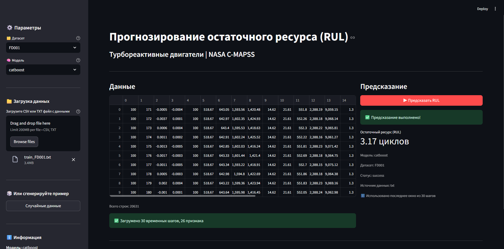
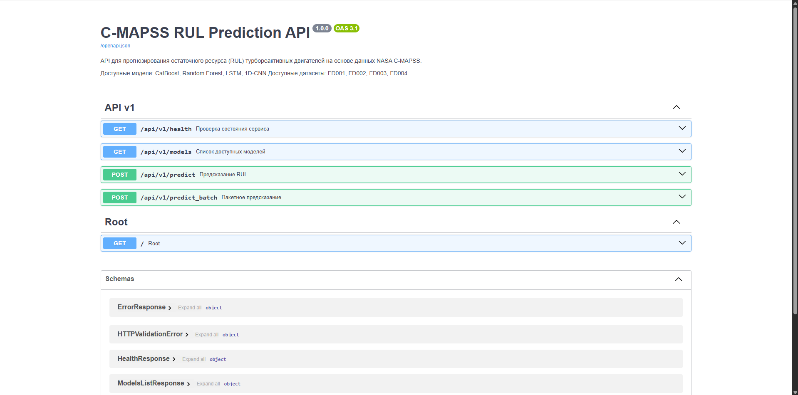

# Прогнозирование остаточного ресурса (RUL) турбореактивных двигателей

[](https://www.python.org/)
[](https://pytorch.org/)
[](https://catboost.ai/)
[](https://fastapi.tiangolo.com/)
[](https://www.docker.com/)
[](https://opensource.org/licenses/MIT)

Прогнозирование остаточного ресурса (Remaining Useful Life, RUL) авиационных турбореактивных двигателей на основе данных NASA C-MAPSS. Проект включает полный ML-пайплайн: от загрузки данных до готового API с веб-интерфейсом.


## О проекте

Проект посвящен прогнозированию остаточного ресурса (RUL) турбореактивных двигателей - одной из классических задач в области прогностического обслуживания. На основе данных с датчиков и операционных параметров модель предсказывает, сколько циклов работы осталось до отказа двигателя.

### Цели проекта

- **Исследование подходов**: Сравнение классических методов ML (Random Forest, CatBoost) и глубокого обучения (LSTM, 1D-CNN)
- **Инженерный подход**: Построение воспроизводимого ML-пайплайна с автоматизацией всех этапов
- **Доведение до готового решения**: Разработка API и веб-интерфейса с контейнеризацией в Docker

### Ключевые задачи

1. **Предобработка данных**: удаление неинформативных датчиков, извлечение статистических признаков для классических моделей, а также создание временных последовательностей для нейросетей
2. **Обучение и количественное сравнение моделей**: сравнение качества моделей, используя MAE, RMSE, R², NASA Scoring Function)
3. **Деплой моделей** на FastAPI с веб-интерфейсом на Streamlit


## Результаты

### Метрики

- **NASA (Scoring Function)** - асимметричная метрика, разработанная NASA для задачи RUL. Штрафует за **позднее** обнаружение отказа сильнее, чем за раннее. Чем **меньше** значение, тем лучше.
- **MAE, RMSE, R²** - стандартные метрики регрессии.

### Качество моделей (тестовая выборка)

#### FD001

| Модель | MAE | RMSE | R² | NASA Score |
|--------|-----|------|----|------------|
| **LSTM** | **11.17** | **15.01** | **0.864** | **4.02** |
| 1D-CNN | 13.66 | 17.49 | 0.815 | 6.25 |
| CatBoost | 11.80 | 15.99 | 0.846 | 5.63 |
| Random Forest | 12.63 | 17.10 | 0.823 | 6.94 |

#### FD002

| Модель | MAE | RMSE | R² | NASA Score |
|--------|-----|------|----|------------|
| **CatBoost** | **15.86** | **20.37** | **0.788** | **10.91** |
| LSTM | 15.32 | 21.27 | 0.769 | 17.10 |
| 1D-CNN | 17.10 | 22.07 | 0.751 | 12.50 |
| Random Forest | 16.25 | 20.61 | 0.783 | 11.06 |

#### FD003

| Модель | MAE | RMSE | R² | NASA Score |
|--------|-----|------|----|------------|
| **LSTM** | **10.65** | **15.08** | **0.858** | **4.14** |
| CatBoost | 12.68 | 17.56 | 0.808 | 13.50 |
| 1D-CNN | 13.47 | 18.28 | 0.792 | 8.22 |
| Random Forest | 12.23 | 17.49 | 0.810 | 14.24 |

#### FD004

| Модель | MAE | RMSE | R² | NASA Score |
|--------|-----|------|----|------------|
| **CatBoost** | **15.48** | **20.64** | **0.784** | **17.97** |
| LSTM | 19.52 | 26.61 | 0.641 | 42.77 |
| 1D-CNN | 19.27 | 24.96 | 0.684 | 17.51 |
| Random Forest | 16.37 | 21.43 | 0.767 | 20.90 |

**Итог**:
- **LSTM** показывает лучшие результаты на FD001 и FD003
- **CatBoost** стабильно хорош на всех датасетах, особенно на сложных (FD002, FD004)
- **1D-CNN** показывает сбалансированные результаты, но уступает LSTM и CatBoost
- **Random Forest** - уступает более сложным моделям
- Результаты DL моделей **могут быть улучшены** при дополнительной оптимизации гиперпараметров

### Производительность инференса (CPU, single-sample)

| Модель | FD001 (мс) | FD002 (мс) | FD003 (мс) | FD004 (мс) | Размер (MB) |
|--------|-----------|-----------|-----------|-----------|-------------|
| **1D-CNN** | **0.53** | **0.56** | **0.57** | **0.54** | 0.7-0.8 |
| **LSTM** | **0.90** | **0.95** | **0.94** | **0.91** | ~2.2 |
| CatBoost | 1.18 | 1.35 | 1.23 | 1.36 | 0.6-1.6 |
| Random Forest | 25.22 | 36.56 | 47.08 | 48.02 | 24.5-170 |

**Итог**:
- **1D-CNN** - лучший выбор при жестких требованиях к скорости
- **LSTM** - оптимальный баланс скорости и качества
- **CatBoost** - выбор для максимальной точности с хорошей скоростью
- **Random Forest** - не рекомендуется из-за большого размера и относительно долгого инференса

**Особенности замеров производительности**:
- **Устройство**: Ryzen 5 7500F (CPU), без GPU
- **Методология**: 100 повторений, 10 прогревочных запусков
- **Режим**: single-sample inference (не батчевый)
- **Накладные расходы**: в указанное время **не включена** загрузка моделей, но **включена** предобработка данных


## Технологии

### ML-стек
- **Классические модели**: scikit-learn (Random Forest), CatBoost
- **Глубокое обучение**: PyTorch (LSTM, 1D-CNN)
- **Оптимизация гиперпараметров**: Optuna
- **Предобработка**: Pandas, NumPy
- **Визуализация**: Matplotlib
- **Сериализация**: joblib (RF, scalers), .cbm (CatBoost), .pt (PyTorch)

### Backend & UI
- **API**: FastAPI + Uvicorn
- **Веб-интерфейс**: Streamlit
- **Контейнеризация**: Docker + Docker Compose

## Структура проекта

```
cmapss-rul-prediction/
├── app/                          # FastAPI приложение
│   ├── api/                      # Маршруты и Pydantic-модели
│   ├── core/                     # Конфигурация, инференс, модели
│   └── main.py                   # Точка входа
├── config/                       # Конфигурационные файлы
│   └── best_params.yaml          # Лучшие гиперпараметры моделей
├── data/                         # Данные (не хранятся в репозитории)
│   ├── raw/                      # Сырые данные C-MAPSS
│   └── processed/                # Предобработанные данные
├── images/                       # Скриншоты проекта
├── models/                       # Сохраненные модели (не хранятся в репозитории)
│   ├── catboost_FD*.cbm
│   ├── rf_FD*.pkl
│   ├── lstm_FD*.pt
│   └── cnn_FD*.pt
├── notebooks/                    # Jupyter ноутбуки
│   ├── 01_eda_and_preprocessing.ipynb
│   ├── 02_catboost_and_rndForest.ipynb
│   └── 03_DL_models.ipynb
│   └── 04_benchmark_inference.ipynb
├── src/                          # Исходный код ML-пайплайна
│   ├── data/                     # Загрузка и предобработка данных
│   ├── models_fitting/           # Обучение моделей
│   └── run_ml_pipeline.py        # Сквозной пайплайн
├── streamlit/                    # Веб-интерфейс
│   └── app.py
├── Dockerfile                    # Docker для API
├── Dockerfile.streamlit          # Docker для Streamlit
├── docker-compose.yml            # Оркестрация контейнеров
├── requirements.txt              # Все зависимости
├── requirements_api.txt          # Зависимости для API
├── requirements_streamlit.txt    # Зависимости для веб-интерфейса
├── run_api.py                    # Запуск API
├── test_predict.py               # Тестовый скрипт для api
├── LECENSE                       # Лицензия MIT
└── README.md
```


## Быстрый старт

### Локальный запуск

```bash
git clone https://github.com/OnufrienkoVS/cmapss-rul-prediction.git
cd cmapss-rul-prediction

# 2. Создание виртуального окружения
python -m venv venv
source venv/bin/activate  # Linux/Mac
venv\Scripts\activate     # Windows

# 3. Установка зависимостей
pip install --upgrade pip
pip install -r requirements.txt

# 4. Запуск ML-пайплайна (загрузка и предобработка данных, обучение моделей)
python src/run_ml_pipeline.py

# 5. Запуск API
python run_api.py

# 6. Запуск веб-интерфейса (в другом терминале)
streamlit run streamlit/app.py
```

### Запуск в Docker

```bash
# Сборка и запуск
docker-compose up -d

# Остановка
docker-compose down
```

После запуска:
- **API**: http://localhost:8000/docs
- **Веб-интерфейс**: http://localhost:8501


## Работа с данными

### Автоматическая предобработка в API

API самостоятельно выполняет всю необходимую предобработку, поэтому пользователю не нужно вручную извлекать признаки или удалять сенсоры. Достаточно подать сырые данные в одном из форматов.

### Форматы входных данных:

1. **Ожидаемый формат**: `window_size × n_features` (удалены лишние сенсоры, unit и cycle)
2. **Полный набор**: 24 признака (op1-3 + s1-s21) - автоматически удаляются неинформативные сенсоры
3. **Сырые данные**: 26 колонок (unit, cycle, op1-3, s1-s21) - удаляются unit, cycle и лишние сенсоры

### Исходные признаки по датасетам

| Датасет | Признаков | Удаленные сенсоры |
|---------|-----------|-------------------|
| FD001 | 17 | s1, s5, s6, s10, s16, s18, s19 |
| FD002 | 24 | - |
| FD003 | 19 | s1, s5, s16, s18, s19 |
| FD004 | 24 | - |

## Скриншоты

### Веб-интерфейс (Streamlit)



### Документация API



## Источники

- [NASA C-MAPSS Dataset](https://data.nasa.gov/dataset/cmapss-jet-engine-simulated-data)
- [CatBoost Documentation](https://catboost.ai/docs/)
- [PyTorch Documentation](https://pytorch.org/docs/stable/index.html)